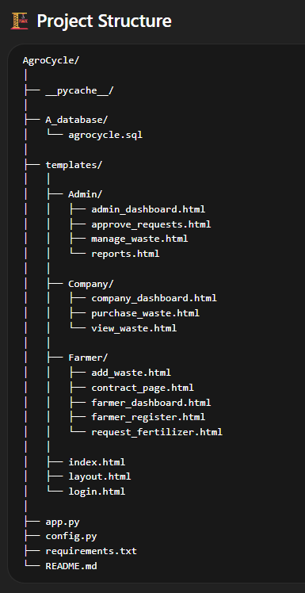

🌱 AgroCycle – Smart Agricultural Waste Management Platform
📌 Project Overview

AgroCycle is a web-based platform designed to connect farmers, companies, and administrators to manage agricultural waste efficiently. The system allows farmers to sell agricultural waste, companies to purchase it, and administrators to monitor the entire process.

The platform helps in reducing waste, promoting recycling, and creating a sustainable agricultural ecosystem.

🎯 Objectives

Provide a digital platform for agricultural waste management

Connect farmers and recycling companies

Track waste transactions and requests

Promote sustainable farming practices

⚙️ Technologies Used
Backend

Python

Flask Framework

Frontend

HTML5

CSS3

Bootstrap

Database

MySQL

Other Tools

SQL

Git & GitHub

VS Code

👨‍🌾 System Modules
Farmer Module

Farmers can:

Register on the platform

Add agricultural waste

Request fertilizer

Manage contracts with companies

View farmer dashboard

Company Module

Companies can:

View available waste

Purchase agricultural waste

Manage purchases

Access company dashboard

Admin Module

Admin can:

Approve waste requests

Manage waste listings

Generate reports

Monitor system activity

🚀 Installation & Setup
1️⃣ Clone the Repository
git clone https://github.com/your-username/agrocycle.git
cd agrocycle
2️⃣ Install Dependencies
pip install -r requirements.txt
3️⃣ Setup Database

Open MySQL

Import the database file

A_database/agrocycle.sql
4️⃣ Run the Application
python app.py
5️⃣ Open in Browser
http://127.0.0.1:5000/
📊 Key Features

✅ Waste listing by farmers
✅ Waste purchasing by companies
✅ Admin approval system
✅ Dashboard for all users
✅ Waste management and reports

🌍 Future Improvements

AI-based waste prediction

Mobile application

Online payment integration

Real-time notifications

Blockchain for supply chain tracking

👨‍💻 Contributors

Shantanu Aher

Team Members (Hackathon Project)

📜 License

This project is developed for educational and hackathon purposes.